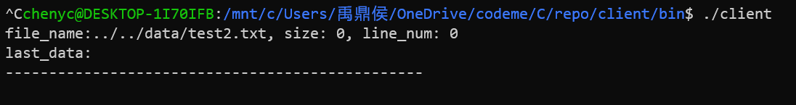
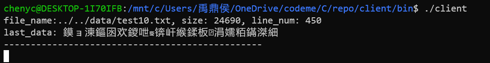

# 1.需求描述

用C语言实现一个服务器客户端模式程序。

1. 服务器程序启动tcp监听端口，客户端程序启动连接到服务器程序
2. 服务器给客户端发送一个文本文件名（包含路径）
客户端返回这个文件的大小、内容行数、最后一行的文本内容，服务端收到结果后打印
3. 服务端通过标准输入读取用户输入的文件名，并广播给当前连接的所有客户端
3. 服务端支持同时处理多个客户端，考虑需支持上万个客户端的情况。
服务端响应时间不能与客户端数量成正比
4. 客户端程序需考虑跨平台性，采用通用系统api实现功能，不能用诸如`wc -l`命令


# 2.需求分析

本需求主要是通过TCP协议建立网络连接，并在客户端和服务器之间传递信息。由于需求中明确提出要求使用C语言，因此，主要涉及到的技术点有如下：

- TCP协议下socket通信客户端和服务器搭建
- 文件IO操作
- 多线程/多进程并发操作
- 线程/进程同步
- 进程间通信（采用多进程的话需要考虑）
- 链表实现（保存客户端连接到服务器的socket，用来广播信息到客户端）
- 客户端跨平台编程


# 3.需求设计

## 3.1 设计思路

### 服务器

- 由于需要支持多并发，因此采用**多线程操作**（也可采用多进程，不过要实现进程间通信，需要创建共享内存，并使用信号量控制进程同步，比较繁琐，故此处没有采用该设计方案 ）。

- 因为要实现服务器向所有连接的客户端广播信息，所以需要将客户端连接到服务器的socket保存到线性表中（线性表需要方便扩容，且删除效率高[客户端断开连接，应该从该线性表中将对应的socket删除]），因此选择使用**链表**。

- 当客户端连接数较多时，可能存在多个客户端同时连上服务器的情况，因此对链表的操作需要支持线程同步，线程同步采用**线程锁**。


### 客户端

客户端的功能相对来说比较简单，主要有二：

- 获取服务器的文件名，并回传文件相关信息
- 打印服务器返回的其他客户端中文件信息

这两项功能互相无影响，因此，并不需要开启多线程来处理，在主线程中完成所有操作即可；

由于需要支持不同平台环境下的客户端程序，文件操作时，像Linux底层的`open()`、`close()`、`read()`、`write()`等函数虽然效率高，但Windows平台并不适用，因此，改用`fopen()`、`fclose()`等通用函数。

客户端的要点在于实现跨平台编程，如本例中支持windows平台和linux平台共用一套代码 ，此处主要使用条件编译方式，通过内置宏定义判断当前操作系统：

```c
#if defined(__linux__)
	//linux代码实现
#elif defined(_WIN32)||defined(_WIN64)
	//windows代码实现
#endif
```

除了需要注意不同操作系统调用的API库的不同带来的socket连接步骤不同之外，还需要注意一些函数名的不同。

- windows下包含的头文件为`winsock2.h`,linux下为`socket.h`
- windows下 多了 一步`WSAStartup`的步骤 
- windows下关闭套接字用的是`closesocket`,linux下用的是 `close`函数 
- 由于windows下编译 环境选择了Visual Studio 2019，一些函数需要调整用法，如`strcpy_s` 代替 `strcpy`, `fopen_s` 代替 `fopen`等。

## 3.2设计流程图

### 服务器


### 客户端


## 3.3开发环境

### 服务器

- windows10自带Linux 子系统WSL2（Ubuntu18.04）

### 客户端

- windows10自带Linux 子系统WSL2（Ubuntu18.04）

- Visual Studio 2019

# 4.测试用例

准备的测试用例文件一共有12个，分别囊括以下场景：

| 文件名                | 描述                                   |
| --------------------- | -------------------------------------- |
| ../../data/test1.txt  | 常规文本文件                           |
| ../../data/test2.txt  | 空文件                                 |
| ../../data/test3.txt  | 只有空行的文件                         |
| ../../data/test4.txt  | 包含汉字的文件                         |
| ../../data/test5.txt  | 文件较大(《天龙八部》全文)             |
| ../../data/test6.txt  | 日志文件                               |
| ../../data/test7.txt  | 英文文档                               |
| ../../data/test8.txt  | 代码文档                               |
| ../../data/test9.txt  | 50万行超大文件                         |
| ../../data/test10.txt | 包含中文乱码的文件                     |
| client                | 二进制文件（非文本文件，应该打开失败） |
| abcd.txt              | 输入的文件名不存在                     |


# 5.测试

## 5.1 linux下测试 

- **案例场景1：**常规文件（输入相对路径，并测试网络连通性 ）

  服务器：

  

  客户端：

  


- **案例场景2：**（输入绝对路径，并测试多客户端连接以及接受信息情况 ）

  服务器

  

  客户端1：

  

  客户端2（之前已经连接的客户端也能收到此条消息）：

  


- **案例场景3：**测试 不同文件的处理：

  - 空文件 

    服务器：

    

    客户端：

    

  - 只包含空格

    服务器：

    

    客户端：

    

  - 包含汉字

    服务器：

    

    客户端：

    

  - 包含乱码文字 

    服务器：

    

    客户端 ：

    

  - 大文件（上万行）

    服务器:

    

    客户端 ：

    

  - 超大文件 （50万行）

    服务器：

    

    客户端：

    

  - 文件不存在 

    服务器：

    

    客户端：

    

  - 非文本文件(二进制可执行文件) 

    服务器：

    

    客户端：

    


- 多并发测试

  使用`test.sh`脚本可以指定连接多个客户端，模拟多客户端 并发情况。

  使用方法如下：

  ```shell
  ./test.sh 100	#100为并发数量
  ```

  由于服务器每当有客户端 连接，需要从标准输入录入文件名 ，这样测试明显来不及，因此 需要开放测试代码 ，将`server.c`第3行条件编译指令打开：

  ```c
  #define SERV_TEST
  ```

  使以下代码生效 ：

  ```c
  #ifdef SERV_TEST
      srand(time(NULL));
      int id = rand() % 11 + 1;   //10 files, 11 random number, contains filename doesn't exsit.
      sprintf(filename, "../../data/test%d.txt", id);
  #endif
  ```

  并将第4行宏定义注释掉：

  ```c
  //#define SERV_BETA
  ```

  使以下代码失效：

  ```c
  #ifdef SERV_BETA
      printf("please input file name(contains path): ");
      scanf("%s", filename);
  #endif
  ```

  保存退出，重新使用`make`指令编译。

  它会自动随机从data目录下选取`test1.txt~test10.txt`文件名向客户端发送，并在`client/bin`目录下生成 对应的 客户端日志，可通过客户端日志查看相对应的连接信息。

  （测试过程：略）

  测试结果：通过。

  

## 5.2 windows下测试

服务器端（Linux）：


客户端（Windows）：


## 5.3 Linux和Windows环境同时测试 

- windows客户端连接，将文件信息 发送到linux客户端 ：

linux服务器：


linux客户端 ：


windows客户端 ：


- linux 客户端连接 ，将 文件信息发送到windows客户端：

linux服务器：


linux 客户端 ：


windows客户端：


测试通过。